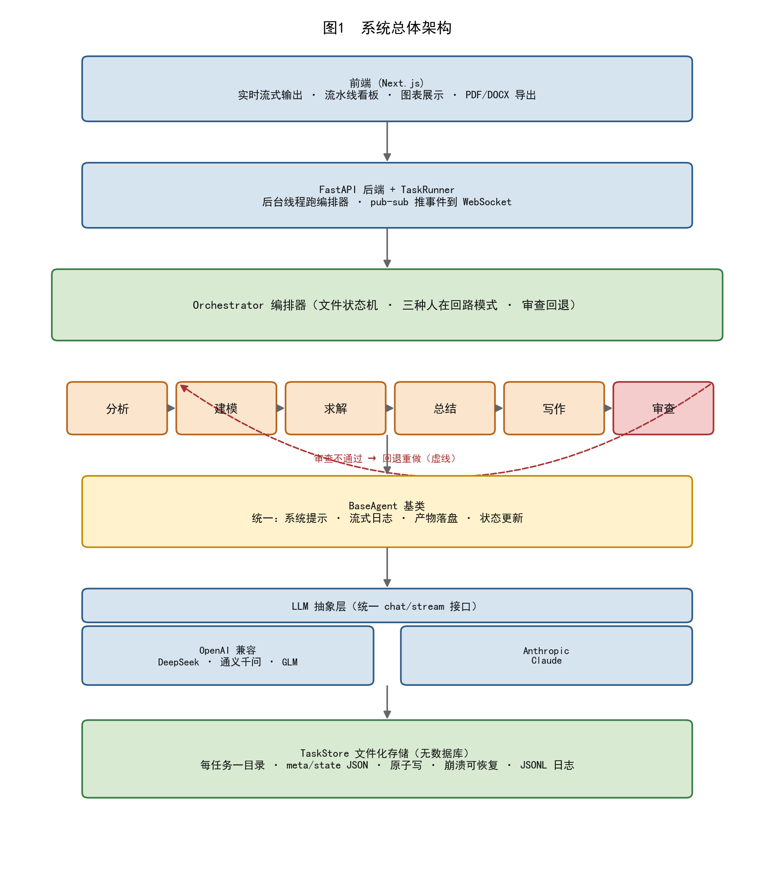
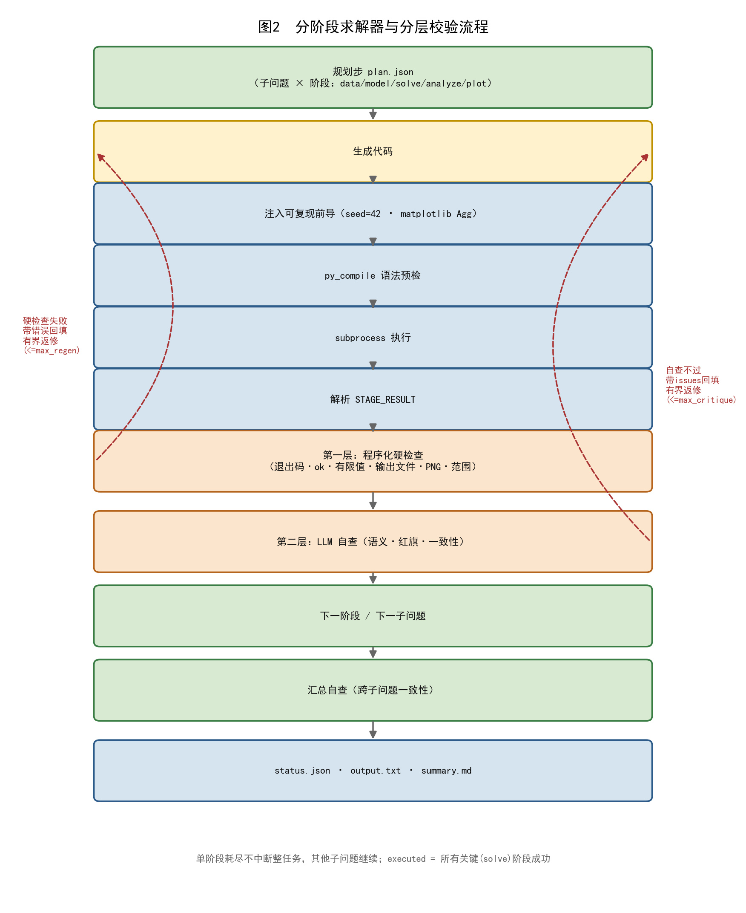
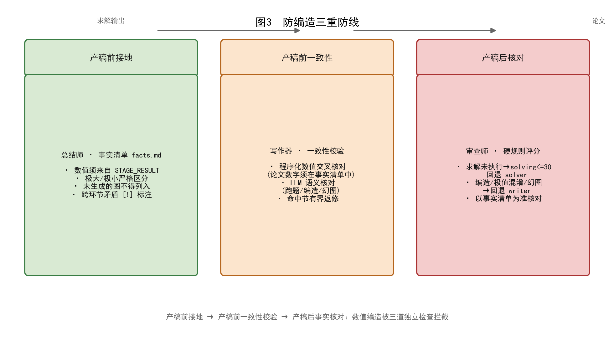

# 基于多智能体协作与分层校验的数学建模自动化系统

> 本文为基于 `modeling-agent` 项目撰写的学术论文初稿。章节 2（相关工作）、5（实验与评估的消融部分）、6（讨论）待补充：相关工作待文献调研完成；消融实验待运行后填入数据。

---

## 摘要

数学建模竞赛（如全国大学生数学建模竞赛，CUMCM）要求参赛者在有限时间内完成问题分析、建立模型、编程求解、撰写论文的完整流程，对综合能力与时间管理要求极高。大语言模型（LLM）为该流程的自动化提供了可能，但现有端到端方案普遍存在四个问题：求解正确率不足、生成的求解代码单薄且考虑不周、输出论文内容单薄、以及论文数值与真实求解结果脱节甚至编造。本文提出一个多智能体协作的数学建模自动化系统，将建模流程分解为分析、建模、求解、总结、写作、审查六个专职 Agent，由文件化状态机编排器串联为可暂停、可恢复、可回退的流水线，并支持全自动、人在回路、混合三种运行模式。系统的核心创新包括：（1）**分阶段求解器**，将单体脚本拆解为"子问题 × 阶段"流水线，并辅以"程序化硬检查 + LLM 自查 + 有界返修"的分层校验机制；（2）**总结师 Agent 作为防编造防火墙**，将求解输出提炼为权威事实清单，作为写作的唯一数据源；（3）**分节写作器**，通过"大纲—逐节生成—扩写薄节—一致性校验"的流水线生成结构完整且忠实于上游结果的论文；（4）**审查师基于事实清单的硬规则评分与回退**。在多道覆盖全题型的 CUMCM 风格问题上的消融实验与案例研究（待补充数据）表明，上述机制显著提升了求解成功率、论文充实度与数值可信度。案例研究显示，系统在线性规划问题上正确求出最优解（$x_1=4,\ x_2=4,\ Z=28$）并完成含灵敏度分析与 9 张图表的约 2.6 万字论文。

**关键词**：大语言模型；多智能体系统；数学建模；代码执行智能体；幻觉缓解；分层校验

---

## 1 引言

### 1.1 背景

全国大学生数学建模竞赛（CUMCM）是国内规模最大的大学生学科竞赛之一，其核心任务是在 72 小时内针对一个开放性实际问题完成"问题分析—建立模型—编程求解—论文撰写"的全流程。这一流程高度综合：既需要数学抽象与建模能力，又需要工程化的编程求解能力，还需要规范的学术写作能力。对多数参赛队伍而言，求解正确性与论文质量往往是制约成绩的瓶颈。

近年来，以 GPT、Claude、DeepSeek、通义千问、GLM 等为代表的大语言模型在代码生成、数学推理与文本撰写上展现出强大能力，为建模流程的自动化提供了新可能。一个直观设想是：输入竞赛题目，由 LLM 自动完成上述全流程并产出论文、代码与图表。然而，直接让单一 LLM 端到端完成建模任务在实践中效果不佳，存在四个突出问题。

### 1.2 问题

**问题一：求解正确率不足。** 数学建模的求解往往涉及数值优化、微分方程、统计推断等，对计算正确性要求高。LLM 直接"心算"数值结果极易出错；即便让其写代码，单次生成的单体脚本常因语法错误、运行时异常或方法不当而失败，且失败后整体重生成会丢失已正确部分。

**问题二：求解代码单薄、考虑不周。** 一次生成一个脚本难以覆盖多子问题、多阶段（数据准备、建模、求解、分析、画图）的完整流程，导致求解浅尝辄止、缺乏图表与灵敏度分析等深度内容。

**问题三：论文内容单薄。** 受单次调用 token 上限制约，一次生成整篇论文难以产出长而细致的论述，章节普遍偏短、展开不足。

**问题四：论文数值与求解结果脱节甚至编造。** 这是最严重的问题。LLM 在写作时倾向于"流畅地编造"——给出看似合理但求解过程并未产出的数值，混淆极大值与极小值，甚至论述根本不存在的图表。这种"幻觉式写作"使论文丧失可信度，且其流畅性反而更难被察觉。

### 1.3 现有方案的不足

现有的 LLM 多智能体框架（如 AutoGen、MetaGPT、ChatDev 等）多面向通用软件任务，缺乏对数学建模"建模—求解—写作"特有结构的针对性设计，尤其缺乏对"论文数值必须由真实求解支撑"这一关键约束的机制保障。代码执行类智能体（如 Code Interpreter、ReAct）能提升数值正确性，但通常止步于求解，不处理论文写作与跨环节一致性。LLM 幻觉缓解研究（如自洽、自反思、链式验证）多在单轮问答场景，未与多阶段流水线的产物校验结合。

### 1.4 本文贡献

针对上述问题，本文设计并实现了一个多智能体协作的数学建模自动化系统，主要贡献如下：

1. **分阶段求解器与分层校验机制**。将单体求解脚本拆解为"子问题 × 阶段"流水线，每个阶段独立生成、执行与校验；校验采用"程序化硬检查（确定性）+ LLM 自查（语义）+ 有界返修"的分层结构，显著抬高求解正确率的下限。
2. **总结师事实清单作为防编造防火墙**。在求解与写作之间引入专门的总结师 Agent，将求解输出提炼为结构化、已核对的事实清单，作为写作的唯一权威数据源，从源头阻断数值编造、极值混淆与幻图。
3. **分节写作器与一致性校验**。写作器由"一次成篇"改为"大纲—逐节—扩写—一致性校验"流水线，每节聚焦上下文以突破 token 限制；组装后通过程序化数值交叉核对与 LLM 语义核对双重校验，保证论文忠实于上游结果。
4. **文件状态机编排器与三种人在回路模式**。采用无数据库的文件化状态机编排六个 Agent，支持全自动、人在回路、混合三种模式，实现透明的暂停/恢复/回退与崩溃恢复。

### 1.5 论文结构

第 2 节综述相关工作；第 3 节介绍系统总体架构；第 4 节详述四项关键方法；第 5 节给出实验与评估；第 6 节讨论局限与有效性威胁；第 7 节总结全文并展望未来工作。

---

## 2 相关工作

本文工作与五个方向相关：LLM 多智能体协作框架、LLM 数学推理与代码执行智能体、自动化数学/科学建模、LLM 幻觉缓解与接地，以及数学建模竞赛自动化。

### 2.1 LLM 多智能体协作框架

多智能体协作通过角色分工与流程编排降低单一 LLM 的发散性。MetaGPT[1] 引入标准作业流程（SOP）与产品经理/架构师/工程师等角色，将协作结构化以减少幻觉式对话；AutoGen[2] 提出可组合的"可对话智能体"，通过灵活的对话拓扑求解任务；ChatDev[3] 将软件开发组织为编码/测试/审查的聊天驱动流水线；CAMEL[4] 用角色扮演的"inception prompting"研究智能体协作与涌现行为；AgentVerse[5] 动态组装智能体团队求解跨领域任务。这些工作的共性是角色流水线与对话或状态机驱动，但均面向通用软件或任务，不针对数学建模的"建模-求解-写作"专业链路，也缺乏对数值正确性的专门治理。本文将流水线特化为数学建模六阶段，并以文件状态机加三种人在回路模式编排，而非纯自由对话。

### 2.2 LLM 数学推理与代码执行智能体

将数值计算下放给程序执行是提升 LLM 数学正确性的主流思路。PAL[6] 与 Program of Thoughts[7] 让 LLM 生成程序作为推理轨迹、由解释器执行计算，将推理与计算解耦；ReAct[8] 提出推理与行动交织的范式，奠定工具调用基础；Toolformer[9] 让 LLM 自监督学习插入工具调用；Zhou 等[10] 实证 GPT-4 Code Interpreter 的数学成功主要归功于生成并执行代码，并提出基于代码的自验证（code-based self-verification）。这些工作证明"程序执行提升数值正确性"，但多止步于单步数值题，不覆盖论文写作与全文一致性。本文将代码执行嵌入求解器并叠加分层校验（程序化硬检查-LLM 自查-有界返修），并延伸至写作阶段的事实清单与分节一致性校验。

### 2.3 自动化数学/科学建模

AI Scientist[11] 实现端到端全自动科研（构思-实验-写论文-自动审稿）；Data Interpreter[12] 面向数据科学的长程互联任务，动态处理中间数据与任务依赖；LLM-SR[13] 用 LLM 编程加符号回归从数据中发现科学方程；MLAgentBench[14] 评测 LLM 智能体在 ML 实验上的能力；AutoSci[15] 以结构化持久记忆为核心覆盖全科研生命周期。这些系统实现了端到端含论文写作，但面向开放科研，不处理建模竞赛特有的"数值不得编造、须与求解结果对齐"约束，也无分节一致性校验。本文以"事实清单+一致性校验"显式防数值编造，并以"有界返修"控制成本。

### 2.4 LLM 幻觉/编造缓解与接地

幻觉缓解主要有统计投票与自反思两条路线。Self-Consistency[16] 采样多条推理路径并多数投票；Self-Refine[17] 与 Reflexion[18] 让 LLM 自生成反馈或反思失败经验并迭代修正；Chain-of-Verification[19] 让 LLM 自行生成验证问题并自答核对；RAG[20] 将生成接地到外部检索文档。这些方法多依赖纯 LLM 自反思或采样投票，缺乏客观程序化约束。本文引入程序化硬检查作为客观锚点，将 LLM 自查与返修"有界化"，避免无限反思与重复投票开销；同时采用"约束输出只用上游求解结果或给定数据"的"内接地"，适合竞赛闭卷场景而非外部检索。

### 2.5 数学建模竞赛自动化

Liu 等[21] 提出面向数学建模竞赛的"问题导向、分阶段"评测框架（基于中国研究生数学建模竞赛题目），揭示 LLM 的"理解-执行鸿沟"--早期阶段（识别/建模）表现好，执行阶段（求解/写代码/结果分析）弱；并诊断根因为"规格不足、缺校验、缺验证，错误跨阶段传播且无修正"。该工作为评测而非系统，且针对研究生赛（CUMCM 为本科生赛），但其诊断与本文动机高度契合。

### 2.6 小结与本文定位

综上，现有工作存在四类不足：(1) 多智能体框架面向通用任务，不针对数学建模专业链路与数值正确性；(2) 代码执行智能体止步于单步求解，不覆盖写作与全文一致性；(3) 自动科研系统不处理"数值不得编造、须与求解结果对齐"的竞赛约束；(4) 防幻觉方法缺乏客观程序化约束。最关键的是，Liu 等[21] 实证诊断了 LLM 在建模竞赛的"理解-执行鸿沟"与"错误跨阶段传播"根因，但仅止于评测。本文系统正是对该诊断的完整系统化回应：分阶段求解器与分层校验阻断错误跨阶段传播，总结师事实清单与写作一致性校验防数值编造，文件状态机与三种人在回路支持可控协作。这一"评测诊断到系统化补救"的对应关系，是本文区别于上述全部工作的核心定位。
---

## 3 系统架构

### 3.1 总体架构

系统采用"专职 Agent + 文件状态机编排器"的架构（图 1）。六个专职 Agent 按固定顺序构成主线流水线：**分析师（analyst）→ 建模师（modeler）→ 求解师（solver）→ 总结师（summarizer）→ 写作师（writer）→ 审查师（reviewer）**。编排器（orchestrator）基于文件化状态机驱动 Agent 依次执行，审查师不通过时可建议回退至指定 Agent。所有 Agent 共享统一的 LLM 抽象层，可对接 DeepSeek、通义千问、GLM（OpenAI 兼容接口）与 Claude（Anthropic 接口），并支持按 Agent 角色分配不同模型。



### 3.2 文件状态机编排器

与基于 LangGraph 等框架的实现不同，本系统采用纯文件化的状态机编排，状态全部持久化为 JSON 文件，无需数据库。每个任务对应一个目录，结构如下：

```
workspace/tasks/<任务ID>/
  meta.json          任务元信息（题目、模式、各Agent模型）
  state.json         编排状态（当前Agent、各Agent记录、历史、审查回合）
  input/problem.txt  原始题目
  data/              上传的数据集
  artifacts/
    analysis.md / model.md / facts.md / paper.md / review.md
    solution/        plan.json · status.json · output.txt · <子问题>/*.py
    figures/         求解生成的 PNG 图表
  logs/              每个 Agent 的流式日志 (JSONL)
```

编排器的核心循环从当前状态运行至暂停或完成：依次实例化各 Agent，构建上下文（每次从磁盘重建以获取最新产物），调用 `agent.run()`，根据返回结果更新状态。该设计带来三个关键能力：

- **可恢复**：`state.json` 记录 `current_agent` 与 `waiting_for_human`，进程崩溃后重启可从断点继续。
- **透明可控**：暂停、恢复、回退逻辑均为显式状态迁移，无隐藏框架行为。
- **原子性**：所有 JSON 写入采用"写临时文件再 `os.replace`"的原子替换（带 Windows 占用重试），避免崩溃损坏状态。

### 3.3 三种人在回路模式

系统通过"检查点"机制支持三种自动化模式，检查点定义了哪些 Agent 完成后需暂停等待人工确认：

| 模式 | 检查点 | 适用场景 |
|------|--------|---------|
| A 全自动（AUTO） | 无 | 批量、无人值守 |
| B 人在回路（INTERACTIVE） | analyst / modeler / solver / writer 后 | 高可靠性，每步人工把关 |
| C 混合（HYBRID） | modeler / writer 后 | 平衡效率与可控，关键决策点确认 |

任务在检查点进入 `PAUSED + waiting_for_human` 状态，由 `resume(decision, feedback)` 唤醒：`approve` 继续下一 Agent；`modify/reject` 回退至刚完成的 Agent 携带反馈重做。这一设计使同一系统可在"全自动快速产出"与"关键节点人工把关"之间灵活切换。

### 3.4 多模型抽象层

LLM 抽象层定义统一的 `chat()` 与 `stream()` 接口，底层适配两类 provider：`OpenAICompatibleProvider` 复用于 DeepSeek、通义千问、GLM（三者均为 OpenAI 兼容接口，仅 `base_url` 不同）；`AnthropicProvider` 适配 Claude（系统消息需单独传）。模型在 `config.yaml` 的 `model_registry` 中注册，可按 Agent 角色分配不同模型（如关键环节用更强模型、简单环节用快模型），并在运行时切换。该设计使系统不绑定单一模型供应商，便于横向对比与成本控制。

### 3.5 实时可观测性

由于编排器与 Agent 为同步阻塞调用（LLM 流式输出），系统将其置于独立后台线程，通过 `call_soon_threadsafe` 将事件投递至 asyncio 队列，再由 WebSocket 消费推送前端。每个 Agent 的流式输出以 JSONL 追加日志，支持连接后先回放历史再实时推送。这一架构使前端可实时展示每个 Agent 的生成过程、执行输出与阶段成败，且日志与产物落盘一致，保证刷新回放与实时流一致。

---

## 4 关键方法

本节详述四项核心创新。其共同范式是**"生成—校验—有界返修"**：每个环节不再单次生成即定稿，而是生成后经确定性校验与语义校验，对不合格产物带反馈重生成，重生成次数有界，耗尽则标记失败但不中断整体流程。

### 4.1 分阶段求解器与分层校验




#### 4.1.1 动机

原求解器一次生成一个不超过 200 行的单体脚本，失败后整体重生成。这导致三个问题：单体脚本浅、阶段不分；修复会丢失已正确部分；无结果合理性校验、无可复现性保障（无随机种子、无 Agg 后端）。其根因在于求解器忽略了分析师已输出的"问题拆解"与建模师按子问题建模的结构，仍写一个脚本。

#### 4.1.2 分阶段流水线

重设计后的求解器内部为三步流水线：**规划（plan）→ 逐子问题逐阶段执行（execute）→ 汇总自查（self-critique）**。

**规划步**以一次 LLM 调用综合题目、分析报告、模型与数据文件清单，输出结构化求解计划 `plan.json`：将问题拆为若干子问题，每个子问题包含有序阶段，阶段名取自固定调色板 `{data, model, solve, analyze, plot}`（至少含 `solve`，推荐含 `plot`）。每个阶段声明目标、输入文件、输出文件、方法、预期图表与可选的预期取值范围。规划失败则退化为单子问题单阶段，绝不因规划硬崩。

**执行步**对每个子问题建立独立工作目录作为该子问题所有阶段脚本的 `cwd`，阶段间靠目录内中间文件（`data.csv`/`result.json` 等）自然交接，状态清晰且可单独重跑。每个阶段独立走"生成—校验—有界返修"流水线（详见 4.1.3）。

**汇总自查步**聚合所有阶段的 `STAGE_RESULT`、标准输出、图表与失败阶段，以一次 LLM 调用做跨子问题一致性/正确性复查，写出聚合 `output.txt`、`status.json`（`executed` = 所有关键阶段成功）与 `summary.md`。

#### 4.1.3 分层校验

每个阶段执行后依次过两层校验，均通过才进入下一阶段：

**第一层：程序化硬检查（确定性、零额外 LLM 调用）**。检查项包括：
- `exec_ok`：退出码 0 且未超时；
- `result_line`：能解析到 `STAGE_RESULT:` 行且 `ok=true`；
- `output_file`：计划声明的输出文件存在且非空；
- `finite`：`metrics` 中所有数值有限（无 NaN/Inf）；若计划给了 `expected_range` 则校验落区；
- `figures`：画图阶段声明的每个图表文件真实存在、非 0 字节且为合法 PNG。

此层以零成本拦住崩溃、非法值、文件缺失等确定性故障。

**第二层：LLM 自查（语义、一次额外调用）**。输入阶段目标、代码、`STAGE_RESULT` 指标与输出摘要，判断输出是否合理回应目标、方法是否恰当、有无红旗、与上游是否一致，输出 `{passed, issues, suggestion}`。此层用于拦"跑通了但方法错"等硬检查抓不到的语义问题。

**门控与有界返修**。硬检查失败视作执行错误，带真实错误回填重生成（执行类重试，上限 `max_stage_retries`）；自查不通过则将 `issues` 回填再重生成（自查类重试，上限 `max_critique_retries`）；单阶段总重生成上限 `max_regen_per_stage`。关键设计是：重生成时回填**脚本实际输出的错误信息**（而非仅"STAGE_RESULT 缺失"这类表面描述），使 LLM 能对症修复，避免无效重试。单阶段耗尽则标记失败，但**不中断整任务**——其他子问题继续求解，聚合状态记录哪些阶段失败。

#### 4.1.4 可复现性前导

框架为每个阶段脚本统一注入前导：`random.seed(42)`、`numpy.random.seed(42)`、`matplotlib.use('Agg')`，不依赖 LLM 自觉。这提升了执行确定性与画图稳定性（Agg 后端避免无显示环境报错），种子可由 `preamble_seed` 配置。

### 4.2 总结师：防编造防火墙

#### 4.2.1 动机

问题四（数值编造）的根源在于：求解输出（`output.txt`）混杂代码、`STAGE_RESULT` 与数值，若写作师直接引用，极易误读或凭空补充。需要一个"清洗与接地"环节，把散落的求解结果提炼为干净、已核对的结构化事实，作为写作的唯一权威数据源。

#### 4.2.2 事实清单

总结师 Agent 位于求解师与写作师之间，综合分析、模型与求解结果，输出五节结构化事实清单 `facts.md`：① 问题核心；② 模型核心（变量/目标函数/约束/解法）；③ 求解结果（按子问题，含数值表）；④ 图表清单；⑤ 一致性标注。其系统提示强制如下硬约束：

- 所有数值必须来自 `STAGE_RESULT` 的 `metrics`，禁止编造或推测；材料中没有的数值如实标注"未求解/无数据"；
- 极大值与极小值必须严格区分，依据求解实际数值判定；
- 已生成的图表方可列入，未生成的不得列入，更不得在结论中论述不存在的图；
- 跨环节一致性检查：明确标注分析、建模、求解之间的矛盾（如驻点数量不一致、极大极小混淆、函数形式不符、结论无求解支撑），用 ⚠️ 标记。

写作师的所有章节均以事实清单为首要上下文（见 4.3），从而将"接地"内化为写作的硬约束。审查师同样以事实清单为准核对论文数值（见 4.4），形成"产稿前接地 + 产稿后核对"的双重防线。

### 4.3 分节写作器与一致性校验

#### 4.3.1 动机

问题三（论文单薄）的根源是"一次调用生成整篇"受 token 上限制约。同时，即便分节生成，仍需保证各节忠实于上游、不跑题、不编造。

#### 4.3.2 分节流水线

写作器内部为四步流水线：**大纲（outline）→ 逐节生成（per-section）→ 拼接扩写薄节（assemble + expand）→ 一致性校验（consistency）**。

**大纲步**以一次调用产出 9 个固定章节（摘要、问题重述、问题分析、模型假设、符号说明、模型建立与求解、模型评价与推广、参考文献、附录）的结构化大纲，每节给出要点、目标篇幅与引用哪些子问题结果/图表/代码。

**逐节生成步**每节一次 LLM 调用，只喂该节相关上下文（摘要喂全局摘要；求解子节喂该子问题的模型+事实+图表；附录喂代码）。因调用范围聚焦，每节单次 token 预算更充裕，能写深写透——这是"内容变充实"的关键。每节 prompt 内置接地硬约束：只能用所提供材料中的事实与数值，不得编造，所需数值不在材料中须如实说明。

**拼接扩写步**按序拼接成 `paper.md`，检测过薄节（低于 `min_section_chars` 阈值，如摘要 < 400、求解子节 < 600），对薄节做一次扩写调用，有界（`max_expand_sections`，默认最多 4 节）。

#### 4.3.3 一致性校验

组装后、终稿前，写作器运行显式的一致性校验层，与求解器的"硬检查 + LLM 自查"对称：

- **程序化数值核对（确定性）**：从论文各节抽取所有数字，逐一核对是否出现在事实清单中；对不上的标为疑似编造。
- **LLM 语义核对（一次调用）**：把组装稿与事实清单对照，检查方法/模型是否与建模一致、结论是否有事实支撑、极大极小是否混淆、是否论述不存在的图、是否跑题夹带无关内容，输出 `{offending_sections, off_topic, fabricated_numbers}`。
- **有界返修**：对命中节带"一致性问题"回填重生成（每节上限 1 次、总计 ≤ 3 节），再重组装；仍不通过者标注"待人工核对"，不中断整篇。

### 4.4 审查师：硬规则评分与回退

审查师对全流程产物按五个维度（问题理解、建模、求解、写作、严谨性）打分（0–100），`solving` 权重更高（占 30%），通过线 75。其关键在于两条**硬性规则**，以结构化 JSON 输出供编排器决策：

1. **求解未执行则硬否决**：若求解执行状态为失败或无输出，`solving` 直接给 ≤ 30 分，`passed` 必须为 `false`，`rollback_to` 必须为 `solver`。理由是"代码没跑通即没有真实结果，论文数值不可信"。
2. **数值编造则回退写作**：若论文数值与事实清单不符（编造）、极大极小混淆、论述了不存在的图，`solving` 直接给 ≤ 30 分，`passed` 为 `false`，`rollback_to` 为 `writer`。

审查师被明确要求"不要被论文的流畅程度欺骗，重点核对结论是否有真实求解支撑"，先核对事实清单与论文再打分。这与 4.2、4.3 的产稿前防线呼应，构成"产稿前接地—产稿前一致性校验—产稿后事实核对"的三重防编造体系。

> 注：当前实现在审查不通过时记录意见与建议回退的 Agent 供人工参考，不再自动回退重做，以避免无界循环；自动回退可作为未来配置项。



---

## 5 实验与评估

> *消融实验数据待运行后填入。* 本节将包含：5.1 实验设置（问题集、模型、指标）；5.2 消融实验（分阶段 vs 单体求解器、±总结师、±分层校验、±写作一致性校验）；5.3 跨模型鲁棒性；5.4 案例研究；5.5 结果分析。下方先给出实验设置与案例研究（已有数据）。

### 5.1 实验设置（拟）

**问题集**：6 道覆盖全题型的 CUMCM 风格问题（优化类、评价类、统计预测类、机理建模类、图论网络类），含真实 2025 年 A 题与线性规划问题。

**消融因素**：针对四项创新各设"关掉 vs 完整系统"对照——

| 实验 | 关闭因素 | 配置 | 验证贡献 |
|------|---------|------|---------|
| E1 | 分阶段求解器→单体脚本 | `solver.architecture: monolithic` | 创新 1 |
| E2 | 总结师事实清单 | `pipeline.skip_summarizer: true` | 创新 2 |
| E3 | 分层校验 | `max_regen_per_stage:1, max_critique_retries:0` | 校验机制 |
| E4 | 写作一致性校验 | `writer.consistency_check:false` | 创新 3 |
| E5 | 跨模型 | DeepSeek / 通义 / GLM | 鲁棒性 |

**指标**：求解成功率、阶段成功率、代码量（LOC）、图数量；**编造率**（论文数字不在事实清单/求解输出中的比例）、极大极小混淆率、幻图率；审查分、通过率、回退次数；论文字数、章节完整度；LLM 调用数与成本。

### 5.4 案例研究：线性规划问题

以"原料采购最小成本问题"为例展示端到端流程。题目为：工厂用甲、乙两种原料生产 A、B 两种产品，1 件 A 需 2 kg 甲、1 kg 乙，1 件 B 需 1 kg 甲、2 kg 乙；甲、乙原料最多各采购 12 kg；A 每件利润 3 元、B 每件利润 4 元；求最优产量使总利润最大，并做灵敏度分析。

**求解规划与执行**。求解师将问题规划为 2 个子问题（基本生产计划优化 + 灵敏度分析），各子问题按 `model -> solve -> analyze -> plot` 阶段执行。`status.json` 显示两子问题的全部阶段均成功（`executed: true`），共生成本 9 张图表。

**求解正确性**。子问题 1 调用 `scipy.optimize.linprog` 求得最优解 $x_1^*=4$、$x_2^*=4$，最大利润 $Z^*=28$ 元，两种原料恰好耗尽；子问题 2 对原料可用量 $b_1,b_2$ 做参数扫描（625 个组合），求得甲原料影子价格 0.6667 元/kg、乙原料影子价格 1.6667 元/kg，表明乙原料边际效益更高，应优先采购。结果与理论最优一致。

**事实清单与防编造**。总结师将求解输出提炼为结构化事实清单，关键数值以表格列出并标注来源阶段（如"最优 $x_1$ = 4.0 件 | 来源 solve"），极大值与极小值严格区分（如扫描最大利润 56.0 元 vs 最小利润 -0.0 元分别标注）。写作师以该清单为唯一数据源生成约 **26 742 字**论文，嵌入 9 张图表，正文数值与清单一致。

**审查与防编造机制的实证**。审查师给出总分 **89/100**（通过），分项评分见表 2。值得关注的是，审查师依据硬规则**主动检出附录 C 中 3 个不存在的图文件名**（`fig1_feasible_region.png` 等，事实清单中不存在、正文未引用），判定为"虚假陈述"并扣减写作分至 75；同时指出附录 B 灵敏度扫描表为空、缺支撑。这印证了"产稿前接地-产稿前一致性校验-产稿后事实核对"三重防线中审查师一道的实际作用：即便论文整体通过，幻图与空表仍被识别并记录。

| 维度 | 问题理解 | 建模 | 求解 | 写作 | 严谨性 | 总分 |
|------|---------|------|------|------|--------|------|
| 得分 | 95 | 95 | 95 | 75 | 90 | 89 |

表 2 案例研究审查分项评分

该案例同时暴露了当前实现的一个局限：审查师虽检出幻图问题并建议回退，但当前实现不再自动回退重做（仅记录意见供人工参考），故论文以 89 分通过而未触发重写。这一取舍的讨论见第 6 节。
---

## 6 讨论

### 6.1 贡献有效性

（待消融实验数据补充：分阶段求解器对求解成功率与代码量的提升、总结师对编造率的降低、分层校验与写作一致性校验的作用、跨模型鲁棒性。）

案例研究已提供初步证据：系统在 LP 问题上正确求解并产出忠实于结果的论文；审查师主动检出幻图问题，表明防编造机制并非纸面约束而是实际生效的检查。

### 6.2 局限性

**无标准答案时的校验上限**。分层校验的目标是抬高正确率的下限（拦住崩溃、非法值、方法红旗、阶段间不一致），而非保证结果一定正确。当题目无参考答案时，LLM 自查与审查师均依赖 LLM 判断，存在"用 LLM 校验 LLM"的循环风险；程序化硬检查只能抓确定性故障，无法判定数值是否"对"。这是"通用、不依赖标准答案"取舍的必然代价。

**执行安全**。求解器直接以 `subprocess` 执行 LLM 生成的代码，存在安全风险（恶意或不当代码可能访问文件、网络）。当前实现适合受控环境，生产部署应引入 Docker 沙箱或受限执行环境。本文实验在受控本地环境进行。

**成本**。分阶段求解器与分节写作器将单次调用扩展为多次（求解器约"子问题数×阶段数"次、写作器约 12-15 次），LLM 调用数与 token 成本显著上升。这是以成本换取正确率与论文充实度的有意取舍，可通过为简单环节配置更快模型、缓存等手段缓解。

**审查回退的边界**。当前实现在审查不通过时仅记录意见与建议回退的 Agent，不再自动回退重做，以避免无界循环。案例研究显示，这使已检出的幻图问题未触发自动重写--即系统能"发现"问题但不一定"修复"问题。自动回退（带轮数上限）可作为未来配置项。

**编造率指标的近似性**。实验中编造率用数值字符串交叉核对计算，存在已知假阳性（如 "50" 与 "50.0"、日期类 token），仅供同一问题集上的横向对比，不作为绝对编造量。

### 6.3 威胁有效性

**问题集规模与代表性**。实验问题集规模有限，虽覆盖主要题型，但未必代表 CUMCM 全部难度与风格；结论的外推需谨慎。

**模型版本依赖**。LLM 能力随版本快速变化，实验结论与特定模型版本（如 DeepSeek-v4-pro）绑定；跨模型实验（E5）部分缓解但无法消除该威胁。

**正确性判定**。无 ground-truth 时，求解"正确性"依赖 LLM 评判与人工抽检，存在主观性；对有公认答案的题目（如本文 LP 案例）可客观验证，对开放题则难。
---

## 7 结论与未来工作

本文提出一个多智能体协作的数学建模自动化系统，通过六个专职 Agent 与文件状态机编排器实现建模全流程自动化，并以"生成—校验—有界返修"为统一范式提出四项创新：分阶段求解器与分层校验、总结师事实清单防编造防火墙、分节写作器与一致性校验、审查师硬规则评分与回退。案例研究验证了系统在线性规划问题上从求解到写作的全流程可用性。

未来工作包括：引入 Docker 沙箱提升执行安全性；在可获得参考答案的题目上叠加数值比对校验；探索失败后的自动重规划；以及扩展至更复杂的多目标、随机优化与大规模数据场景。

---

## 参考文献

[1] Hong S, Zhong J, Chen C, 等. MetaGPT: Meta Programming for a Multi-Agent Collaborative Framework[J]. arXiv:2308.00352, 2023.

[2] Wu Q, Bansal G, Zhang J, 等. AutoGen: Enabling Next-Gen LLM Applications via Multi-Agent Conversation[J]. arXiv:2308.08155, 2023.

[3] Qian C, Cong X, Liu W, 等. Communicative Agents for Software Development[J]. arXiv:2307.07924, 2023.

[4] Li G, Hammoud H A, Itani H, 等. CAMEL: Communicative Agents for "Mind" Exploration of Large Language Model Society[J]. arXiv:2303.17760, 2023.

[5] Chen W, Su Y, Zuo J, 等. AgentVerse: Facilitating Multi-Agent Collaboration and Exploring Emergent Behaviors[J]. arXiv:2308.10848, 2023.

[6] Gao L, Madaan A, Zhang R, 等. PAL: Program-aided Language Models[J]. arXiv:2211.10435, 2022.

[7] Chen W, Yin M, Ku M, 等. Program of Thoughts Prompting: Disentangling Computation from Reasoning for Numerical Reasoning Tasks[J]. arXiv:2211.12588, 2022.

[8] Yao S, Zhao J, Yu D, 等. ReAct: Synergizing Reasoning and Acting in Language Models[J]. arXiv:2210.03629, 2022.

[9] Schick T, Dwivedi-Yu J, Dessì R, 等. Toolformer: Language Models Can Teach Themselves to Use Tools[J]. arXiv:2302.04761, 2023.

[10] Zhou A, Yan Y, Shlapentokh-Rothman M, 等. Solving Challenging Math Word Problems Using GPT-4 Code Interpreter with Code-based Self-Verification[J]. arXiv:2308.07921, 2023.

[11] Lu C, Lu C, Lange R T, 等. The AI Scientist: Towards Fully Automated Open-Ended Scientific Discovery[J]. arXiv:2408.06292, 2024.

[12] Hong S, Lin Y, Liu Z, 等. Data Interpreter: An LLM Agent For Data Science[J]. arXiv:2402.18679, 2024.

[13] Shojaee P, Jain A, Tipirneni S, 等. LLM-SR: Scientific Equation Discovery via Programming with Large Language Models[J]. arXiv:2404.18400, 2024.

[14] Huang Q, Vora J, Liang J, 等. MLAgentBench: Evaluating Language Agents on Machine Learning Experimentation[J]. arXiv:2310.03302, 2023.

[15] Qian W, 等. AutoSci: A Memory-Centric Agentic System for the Full Scientific Research Lifecycle[J]. arXiv:2605.31468, 2026.

[16] Wang X, Wei J, Schuurmans D, 等. Self-Consistency Improves Chain of Thought Reasoning in Language Models[J]. arXiv:2203.11171, 2022.

[17] Madaan A, Tandon N, Gupta P, 等. Self-Refine: Iterative Refinement with Self-Feedback[J]. arXiv:2303.17651, 2023.

[18] Shinn N, Cassano F, Berman E, 等. Reflexion: Language Agents with Verbal Reinforcement Learning[J]. arXiv:2303.11366, 2023.

[19] Dhuliawala S, Komeili M, Xu J, 等. Chain-of-Verification Reduces Hallucination in Large Language Models[J]. arXiv:2309.11495, 2023.

[20] Lewis P, Perez E, Piktus A, 等. Retrieval-Augmented Generation for Knowledge-Intensive NLP Tasks[J]. arXiv:2005.11401, 2020.

[21] Liu Y, Huang H, Yang Y, 等. How Far Are We? Systematic Evaluation of LLMs vs. Human Experts in Mathematical Contest in Modeling[J]. arXiv:2604.04791, 2026.

> 注：以上 arXiv 编号经 arXiv 官方 API 核实；会议/期刊正式归属部分待投稿前核对（如 ICLR/NeurIPS/ACL proceedings）。[15][21] 为 2026 年新预印本，引用前请确认最新版本与是否被会议接收。
